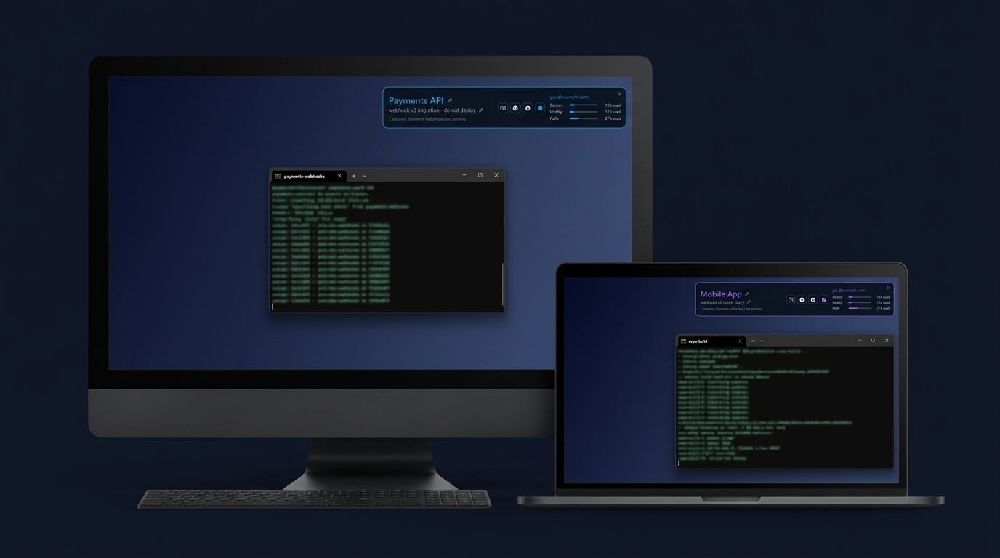
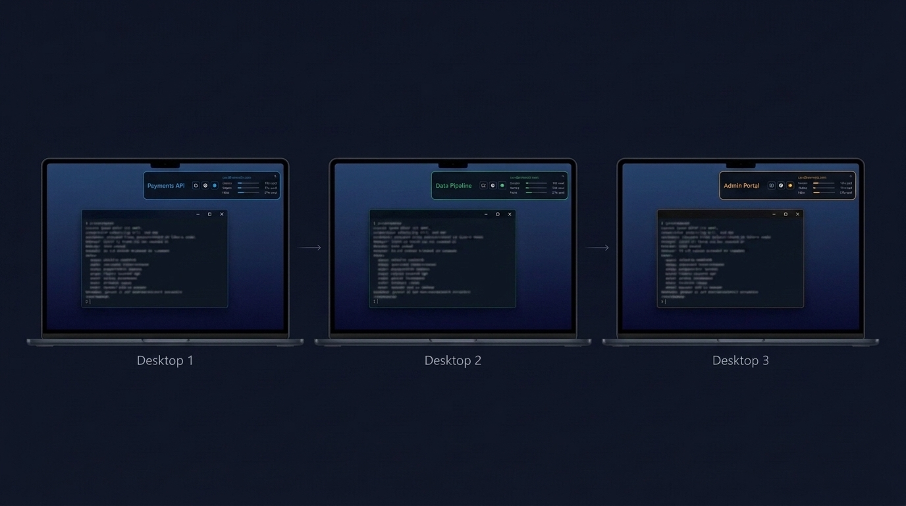
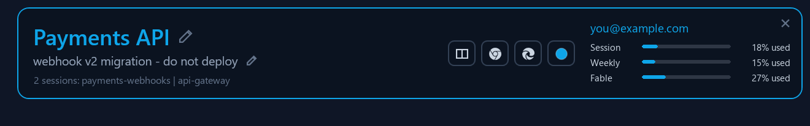

# JITR DeskBar

**One tool to keep your sessions straight when you work on many projects at
once** — across multiple monitors on a desktop, multiple virtual desktops on a
laptop, or multiple computers on one desk.



DeskBar pins an always-on-top information bar to the corner of the screen.
Every Windows virtual desktop gets its own bar identity — editable title, quick
note, accent color, app launchers, and (optionally) live Claude Code account
and usage meters — so one glance tells you which project this screen belongs
to before you type into the wrong window.

## The problem

If you keep one project per screen — swiping between virtual desktops on a
laptop, or spreading projects across the machines on your desk — the screens
themselves are anonymous. Links open on the wrong desktop, every terminal looks
like every other terminal, and sooner or later you type a prompt meant for one
project into a session that belongs to another. With an AI session on each
screen, that mistake is expensive.

DeskBar gives each desktop a permanent, color-coded identity:



The bar itself, up close:



## Features

- **Per-desktop identity** — title, one-line note, and accent color are stored
  per virtual desktop and swap automatically (~400ms) when you switch. New
  desktops start with defaults on first visit.
- **Launchers** — one-click buttons to open two side-by-side terminal windows
  (`wt.exe`), a new Chrome window, or a new Edge window on the current desktop.
- **Claude Code integration (optional)** — shows the logged-in account email,
  Session / Weekly / per-model usage meters (reset times in tooltips), and a
  line listing the Claude Code sessions running on the *current* desktop.
  Running DeskBar on each of several computers also tells you at a glance which
  Claude account each machine is using and how much of its limits are left.
  Without Claude Code, these degrade gracefully ("n/a") and everything else
  works.
- **Stays out of the way** — no taskbar button, no alt-tab entry. Drag any
  empty area to move it (snaps to screen edges); the X hides it to a tray icon;
  right-click for Refresh / Reset position / Start with Windows / Exit.
- **Single small exe** — no installer, no runtime to download, instant startup,
  a few MB of RAM.

## Requirements

- Windows 10 or 11 (uses Windows virtual desktops).
- .NET Framework 4.8 — preinstalled on Windows 10 1903+ and all Windows 11.
- Optional, for the Claude meters/sessions features: [Claude Code](https://claude.com/claude-code)
  logged in on the machine.

No admin rights needed. Nothing is written outside `%USERPROFILE%\.jitr\deskbar.json`
(settings) and, if you enable "Start with Windows", a shortcut in your Startup folder.

## Install

**Option A — download:** grab `jitr-deskbar.exe` from
[Releases](../../releases), put it anywhere (e.g. `%LOCALAPPDATA%\jitr-deskbar\`),
and run it. Right-click the bar → "Start with Windows" to make it permanent.
Repeat on each machine you work from.

**Option B — build from source** (no SDK needed; uses the C# compiler that
ships inside Windows):

```powershell
git clone https://github.com/nnolasco/jitr-deskbar
cd jitr-deskbar
.\build.ps1        # -> bin\jitr-deskbar.exe
```

## Usage

| Control | What it does |
|---|---|
| Pencil icons | Edit the title / note (Enter commits, Esc cancels) |
| Colored dot | Pick the desktop's accent color (presets + custom) |
| Split-rectangle | Launch two terminals side by side on this desktop |
| Chrome / Edge marks | New browser window on this desktop |
| Drag empty area | Move the bar; snaps to screen edges within ~36px |
| X (top-right) | Hide the bar; the tray icon brings it back (left-click) |
| Right-click | Refresh, Hide, Reset position, Start with Windows, Exit |

Settings live in `%USERPROFILE%\.jitr\deskbar.json`. Bar size is configurable
there (`widthFraction`, default 0.5 of the screen width; `barHeightDip`,
default 100) — edit and right-click → Refresh.

## How it works

Design notes and the full mechanism live in [SPEC.md](SPEC.md). The short
version:

- The bar is a `WS_EX_TOOLWINDOW` window, which Windows shows on **every**
  virtual desktop — so one window serves all desktops and only its content
  swaps.
- Desktop switches are detected by polling the current-desktop GUID that the
  shell maintains at
  `HKCU\...\Explorer\VirtualDesktops\CurrentVirtualDesktop`; profiles are keyed
  by that GUID.
- Claude usage comes from the same OAuth endpoint the Claude Code `/usage`
  screen uses, with the token Claude Code keeps on disk. Session detection reads
  the `✳ <session name>` titles Claude Code writes into terminal tabs, filtered
  to windows on the current desktop via `IVirtualDesktopManager`.
- Everything is documented, stable API surface plus one long-lived registry
  value — no undocumented per-build COM interfaces.

## Roadmap

- Per-monitor bars on multi-monitor setups (today: one bar on the primary
  monitor per machine).

## Platform notes

Windows-only. The rendering is WPF and every mechanism above (virtual desktop
GUIDs, tool-window behavior, `IVirtualDesktopManager`, work-area snapping) is
Win32/shell-specific. A macOS equivalent targeting Mission Control Spaces would
be a from-scratch rewrite — macOS has no public API for identifying or watching
Space switches, so that port is not planned.

## Screenshots and imagery

`docs/screenshot.png` is a real capture running with demo data. The
multi-device images are AI-generated illustrations of the same UI; terminal
content in all imagery is blurred placeholder text, never real sessions.

## License

MIT — see [LICENSE](LICENSE).
